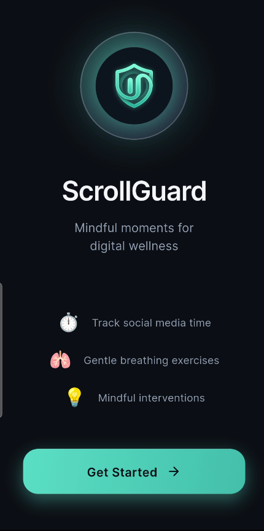

# ScrollGuard

<p align="center">
  
</p>

<p align="center">
  An Android Flutter app that helps users set mindful limits for selected social media apps.
</p>

<p align="center">
  
  
  
  
</p>

## What it does

ScrollGuard monitors the selected social media apps on Android. Once the configured session limit is reached, it shows a native overlay and opens a mindful intervention with breathing, dhikr, or both.

The supported built-in targets are YouTube, Instagram, TikTok, and Facebook. Usage is combined across all enabled targets in the current protection session.

## User flow

1. **Welcome** — introduces the app.
2. **Select apps and time limit** — the user chooses monitored apps and a session limit.
3. **Enable permissions** — Usage Access, Accessibility Service, and overlay permission are requested.
4. **Start protection** — current device usage becomes a baseline; the new protected session starts at zero.
5. **Dashboard** — shows session progress, selected app logos, dhikr total, and quick access to mindful activities.
6. **Time limit reached** — Android displays a native overlay. Opening ScrollGuard leads to the intervention screen.
7. **Mindful pause** — the user has a short 10-second pause, then completes a breathing exercise, dhikr, or continues.

## Mindful activities

### Dhikr

The dhikr screen is an interactive 33-bead tasbih counter. It includes a persistent **Another Dhikr** button and tracks counts independently for each phrase as well as the daily total.

Current phrases:

- **Istighfar** — *Astaghfirullah wa atoobu ilayh*
- **Tasbih** — *SubhanAllah wa bihamdihi*
- **Salawat** — *Allahumma salli wa sallim 'ala nabiyyina Muhammad*

### Box breathing

The breathing exercise guides three 4-4-4-4 cycles: inhale, hold, exhale, and hold. Haptic feedback can be enabled in Settings.

### Intervention mode

Settings offers three modes:

- Dhikr only
- Breathing only
- Both

## Android implementation

The monitoring and intervention flow uses Android platform APIs through Kotlin and Flutter method channels.

| Component | Purpose |
| --- | --- |
| `UsageStatsManager` | Reads daily usage for selected app package names. |
| `AccessibilityService` | Detects the current foreground app and runs the active session timer. |
| `OverlayService` | Displays the time-limit overlay above the monitored app. |
| Flutter `MethodChannel` | Connects Flutter settings, permissions, usage data, monitoring, and navigation to the Android layer. |

The native trigger has been manually verified on a Samsung SM-S901B in debug mode: a monitored YouTube session reached its limit, logged the intervention trigger, and displayed the overlay. Broader device and Android-version testing is still needed.

> Android may warn about restricted settings when installing a sideloaded APK because ScrollGuard requests Accessibility access and overlay permission. These permissions are required for the monitoring and intervention flow. Only enable them for builds you trust.

## Local data and privacy

ScrollGuard has no backend, account system, cloud database, or analytics service. App data is stored locally with `SharedPreferences`:

- onboarding status and preferences
- selected apps and time limit
- theme, intervention mode, haptics, and sound preference
- daily session usage, usage baseline, and intervention count
- daily dhikr totals and phrase-specific counts

## Tech stack

- Flutter and Dart
- Kotlin for Android services
- Riverpod (`StateNotifierProvider` and `AsyncValue`) for app state
- GoRouter for navigation
- SharedPreferences for local persistence
- Flutter Animate for UI animation
- Google Fonts and Material UI

## Project structure

```text
lib/
├── app.dart
├── main.dart
├── router.dart
├── providers/
│   └── providers.dart
├── core/
│   ├── constants/
│   ├── theme/
│   └── widgets/
├── data/
│   ├── models/
│   ├── repositories/
│   └── services/
└── features/
    ├── onboarding/
    ├── dashboard/
    ├── intervention/
    └── settings/
```

## Run locally

```bash
git clone https://github.com/Maher-Tec/scrollguard.git
cd scrollguard
flutter pub get
flutter run
```

For the full monitoring flow, use a physical Android device and enable the requested Android settings during onboarding.

## Current limitations

- The intervention is a pause prompt and overlay; it does not enforce a hard operating-system-level block of other apps.
- `just_audio` is included and a sound preference is exposed, but calming audio playback and audio assets are not yet implemented.
- Automated Android device tests for Accessibility, overlay, and timing behavior are not yet present.
